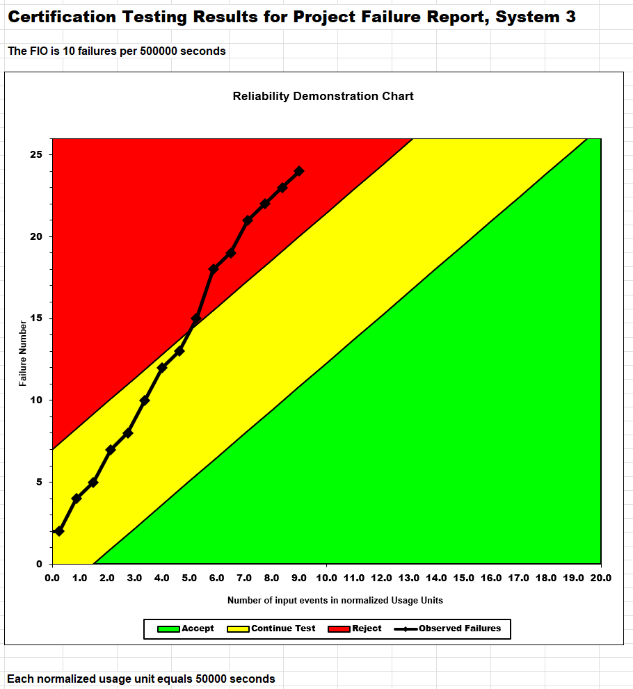
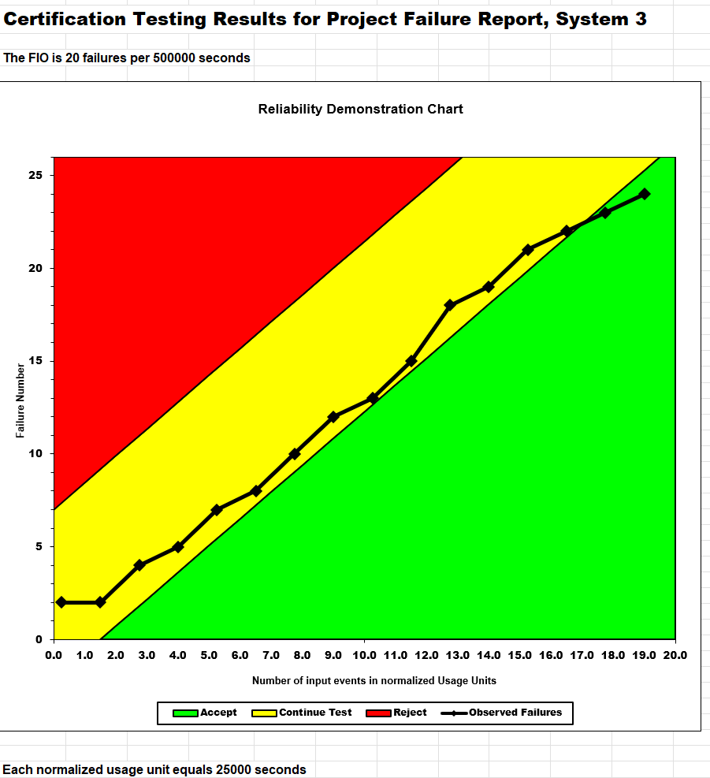
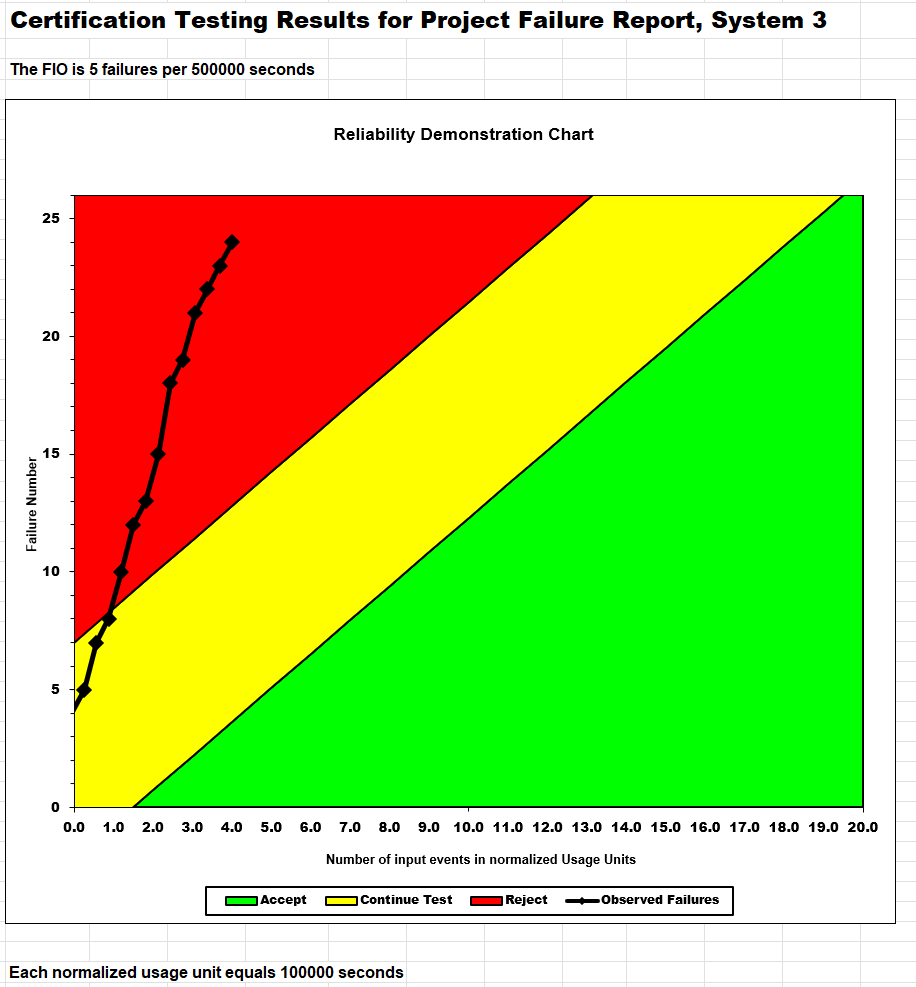

**SENG 438- Software Testing, Reliability, and Quality**

**Lab. Report #5 – Software Reliability Assessment**

|Group 04:||
|-|-|
|Student Names:||
|Adol Awan||
|Jane Zhang||
|Sam Shojaei||
|Uchenna Osemeka||
|Lex Berezowski||

# Introduction
The purpose of this laboratory experiment was to examine data from a failure process, understand what the values from the reliability indicators, including MTTF, mean, and ascertain if the tested SUT was acceptable. Reliability Growth Testing was utilized in analyzing the trend for the system's reliability, whereas RDC was applied as a decision-making tool in evaluating its reliability.
By performing this experiment, we have become familiar with handling data from failed tests, utilizing reliability analysis software, and analyzing the statistical model. We have learned about the dynamics of reliability through test analysis and the application of various reliability evaluation methods in practice.

# Assessment Using Reliability Growth Testing
In this part of the lab, we use the failure data supplied in file Failure Report 3 to assess reliability of SUT with Reliability Growth Testing Analysis in CSFRAT.
After pre-processing and opening the data in CSFRAT, we run an estimation and get several different model results from combinations of chosen hazard function and co-variants. As the effort data (e, f, c) wasn’t supplied we assumed a uniform 1 across the board.

 
Above is a graph representation of our failures over time .As can be observed above, it is hard to tell exactly which models fit best purely off graphical representation. 

##Result of model comparison (selecting top two models)
The Model Comparison table below paints a clearer picture of our best models for the data.

This comparison uses various best fit measures to determine which of the models is statistically the best fit. We use the Critic(Mean), and Critic(Median) as an overall measure of good fit with additional weight assigned to predictive power in PSSE. We find GM(Geometric) to be the best model and NB2(Negative Binomial Order 2) to be second best.

##Result of range analysis 
For which part of the data is good to analyze, we decided to work from the 3rd interval so 120seconds onward, as there is a big fluctuation in the 60-120 interval which could be attributed to the early-stage testing barrier. From then onward relatively normal fluctuations are observed, and a general decrease in failures is observed over time.

##Plots for failure rate and reliability of the SUT for the test data provided
 
Failure Intensity Plot

Cumulative Failure Plot

As there is no explicit “reliability” plot in CSFRAT, we simply judge reliability by looking at failures.

##A discussion on decision making given a target failure rate
With a known target failure rate, you can use CSFRAT to determine how many intervals it would take to get a failure intensity low enough to meet target. This length of intervals can then be used to estimate time till you can reliably deploy a piece of software.
 

Here we can see that what I judge to be the best model GM will take close to 60 intervals to get a failure intensity down to 0.5 but our next model NB2 predicts 20 intervals to reach target reliability. These significant variations in model predictions play a big role in estimating software reliability growth, and can make a big difference in investment prioritization for software.

##A discussion on the advantages and disadvantages of reliability growth analysis
Reliability growth analysis lets you predict how many intervals it would take to ensure a specific degree of reliability in your system. This allows you make sometimes very accurate estimations on time spent fixing issues, and it even allows you to incorporate effort into the model’s predictions. This tool helps planning and estimation in software reliability greatly.
On the flipside, its hard to consistently predict real world phenomena, like bug finding, accurately. No matter the model it can’t guarantee truth, and it is largely dependent on the data it receives. Corruption in the data from incorrect reporting, as well as large variations in failure intensity are harder to model. Lastly, choosing the right model itself does not guarantee you’ve chosen the correct one, as the various measures are only so correct.

# Assessment Using Reliability Demonstration Chart
## Evaluation and Assumptions
Before jumping into the graphs, we will explain how we came up with the MTTFmin and how the chart was used to assess the reliability of what was found in Failure Report 3. The MTTFmin was found from trial and error directly using the Reliability Demonstration Chart provided to us under "RDC-11" folder. After understanding how the graph works, ensuring the axes of the graph were correct, we adjusted the data which calculates the MTTF until an ideal value was found. Without the necessary information such as kind of software, the discrimination ratio, developers risk, and users risk, we had to make an assumption of what we believe the best MTTFmin value would be. In this scenerio, we deemed that 10 failures for every 500,000 seconds, or a MTTFmin of 0.00002 (10/500,000) is acceptable. The reason behind this is because more data points would be in the yellow, or the "Continue" region. In addition, maximum 10 failures per every 6 days (500,000s/(60s * 60m * 24h)) seemed like a reasonable number of allowable system failures.
## The MTTF Minimum

Based on what was explained above, we can use the trend to analyze what is happening with the system during runtime. We can see that in the earlier stages, the system needs to continue testing in order to dip down to meet the failure intensity objective acceptance criteria. However, at a little over half of the system runtime, it enters into the red, or "Reject", zone. This leads to the conclusion that at that point, the system fails to meet its failure intensity objective. Overall, the reliability assessment shows that based on our assumptions, this system does not quite meet the reliability criteria for consumers.

## Twice the MTTF Minimum

Now take a look at the second graph. Keeping all else the same, we doubled the MTTFmin to 20 failures (MTTFmin = 0.00004 = 20/500,000). You may notice that all points stay in the yellow grid and a couple points to make it into the green, or "Accept", region. The reason behind this is because we are allowing more failures in the same runtime interval. By loosening the restrictions, the trend shows that the system only need more testing before reaching an acceptable assessment.

## Half the MTTF Minimum

Lastly, we halved the MTTFmin to 5 failures (0.00002 = 5/500,000). By putting a higher restriction on the system, we can see that it mostly gets rejected. The trend shows the more restricted a system is, the more work and effort the developers need to put in to pass the reliability criteria.

# Comparison of Results
## Actual results between Reliability Growth Testing (RGT) and Reliability Demonstration Chart (RDC)

 
 Our results between the two parts of this lab highlight different aspects of determining software reliability. 
 
 In part 1, we determine a good model for predicting failure growth by comparing best fit measures for the different hazard functions. Using our chosen model, we determine it would take 60 intervals to guarantee reliability at a 0.5 failure intensity.
 
 In part 2, we do not try to predict, instead we demonstrate how reliable our system already is to determine if we can ship the product or if more testing is still required.
 Both charts reflect reliability but with different aims and uses.

## Conclusion
RGT is primarily used during the pre-release development phase to improve the system's reliability over time as bugs are identified and fixed, while the RDC is a graphical method focusing on a binary "Accept/Reject" decision for the SUT. Using the RDC taken from the Excel document, it requires manual work and is only liable for small amounts of data. Even then, it is very time consuming for even the few failure data points being evaluated. In addition, without complete information being shared, it only adds to the difficulty. If only evaluating a small dataset, both RGT and RDC are great tools for analysis. 

# Discussion on Similarity and Differences of the Two Techniques
Similarities between RDC and Reliability Growth:
- Both use inter-failure times and MTTF to determine the reliability of the data

Differences:
- Reliability Growth can also take failure count (in addition to inter-failure times and MTTF) to determine reliability, while RDC cannot
- RDC can only indicate whether the SUT is acceptable or not, whereas Reliability Growth shows whether the SUT undergoes reliability growth, decrease, or stable reliability
- RDC does not provide a quantitative measurement of reliability, while Reliability Growth gives a quantitative measure of reliability

# How the team work/effort was divided and managed
For how the work was divided, our approach was a bit different from a traditional split.

For the technical portion, specifically reliability growth testing, we chose to explore the tool and the process independently. This was intentional, because we felt it was important for each team member to gain a full understanding of key steps such as data processing, importing data into the software, and interpreting the different metrics. Since we had about two weeks, this approach allowed everyone to build deeper individual understanding.

For the report, however, we collaborated more directly. We discussed our overall experiences as a group,especially for sections like challenges and lessons learned and then divided the writing so that each member was responsible for a specific section.

So overall, our workflow was a combination of independent learning for technical depth and collaborative effort for reflection and reporting
# 

# Difficulties encountered, challenges overcome, and lessons learned
One of the main challenges we faced as a group was getting familiar with a new tool and understanding how to use it effectively.

Since we were working on reliability growth testing, we first had to process the data, which was quite time-consuming. But beyond that, we also had to ensure the data we generated was compatible with the software/reliability growth testing tool.

Another challenge was understanding the different evaluation metrics for the models used. There were many metrics available such as BIC, AIC, and it wasn’t always clear which ones were most relevant for the models we were using.

To overcome these challenges, we relied heavily on teamwork. We used our group chat to communicate whenever someone encountered a problem, they would ask, and others who had already figured it out would help guide them. This really helped us move forward more efficiently.

In terms of lessons learned, one key takeaway was the importance of collaboration and seeking help early. We also learned to make better use of available resources, such as online tools and documentation, and to take time to fully understand the assignment before starting, which ultimately saved us time in the long run.
# Comments/feedback on the lab itself
The lab provided a useful introduction to software reliability concepts and practical tools. It was helpful to work with real data and apply techniques like reliability growth testing and RDC. 
